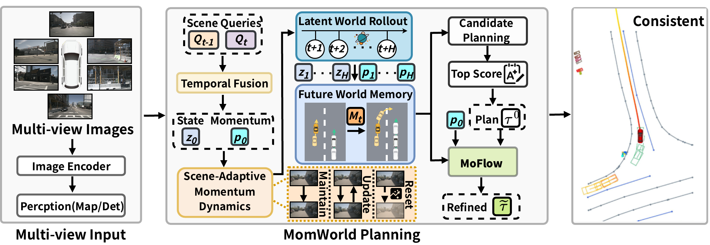
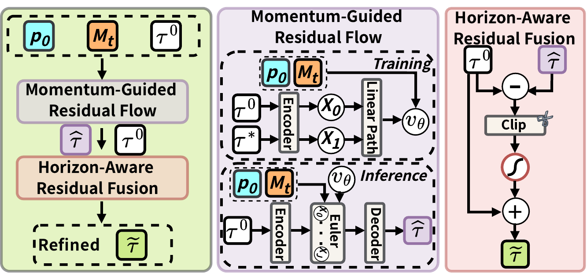
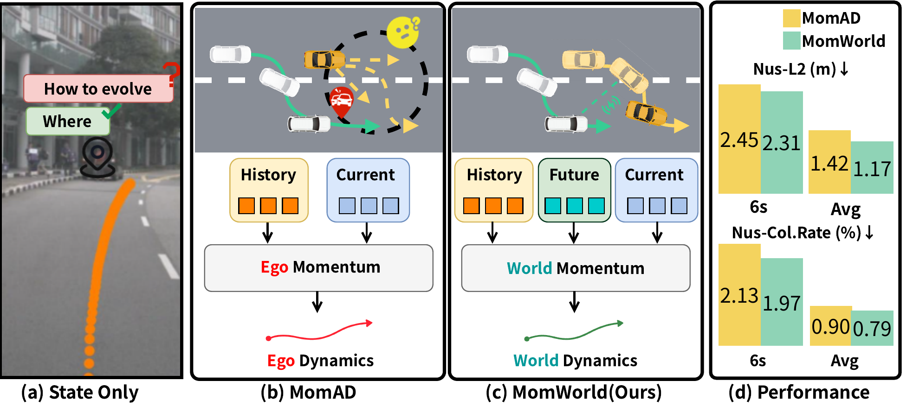
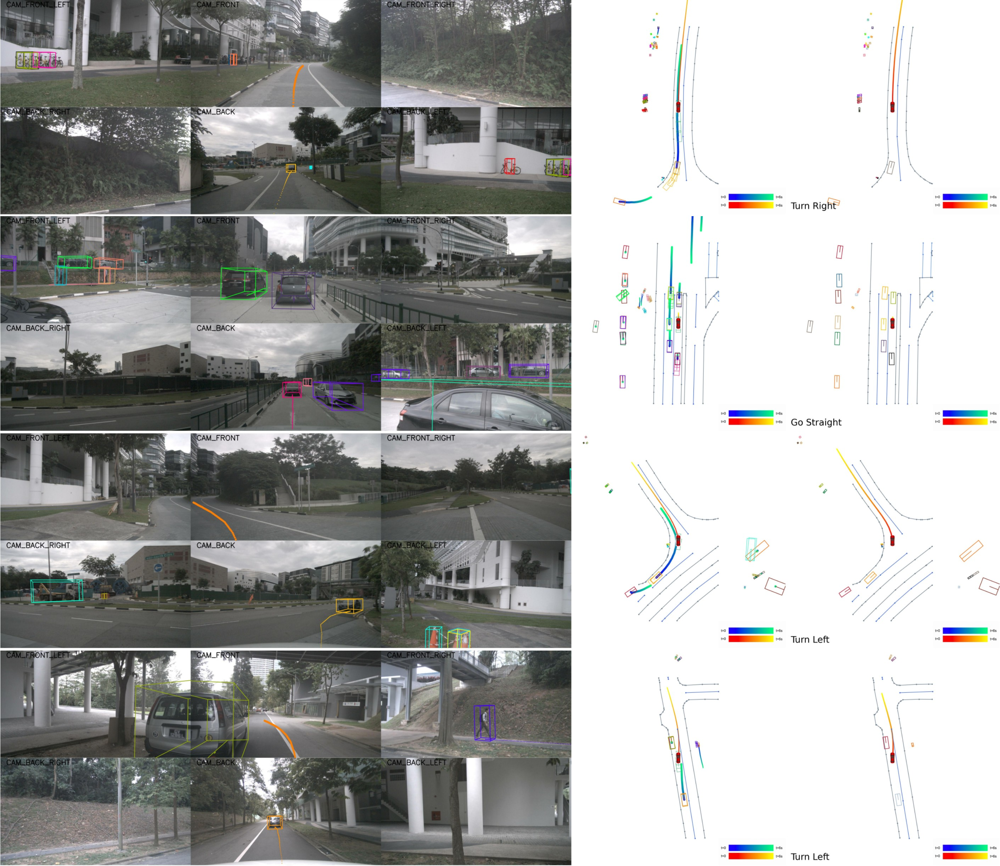

# MomWorld

**Momentum-Aware Latent World Model for Long-Horizon Autonomous Driving**

MomWorld connects historical and current Scene Queries to future world evolution through latent state-momentum rollout, future-memory-based candidate planning, and bounded trajectory refinement.

<p align="center">
  
</p>

## Code status

The current `main` branch contains a substantive 6-second nuScenes MomWorld prototype rather than a simple rename of MomAD. It implements a mode-conditioned 12-step latent world rollout, training-only future ego/agent supervision, state reconstruction, and gated long-horizon trajectory residual fusion.

However, this branch is **not yet the exact paper-final implementation shown above**. In particular, the explicit paired state-momentum dynamics, Scene-Adaptive Momentum Dynamics, Future World Memory, and complete MoFlow path are not all present in the current nuScenes code. The paper-final implementation is therefore not claimed by this branch until those modules and reproducibility artifacts are released together.

## Repository branches

| Branch | Benchmark | Contents |
| --- | --- | --- |
| [`main`](https://github.com/modaxiansheng/MomWorld/tree/main) | nuScenes | Current 6-second latent-world prototype, future-supervision pipeline, configs and evaluation code |
| [`navsim/`](navsim/) | NAVSIM v1 / v2 | Filtered release of the paper-reported result1 and the later post-paper optimized result, with frozen selectors, safety gates, strict evaluation, tests and verified hashes |

## Paper method

- **Momentum-Aware Latent World Modeling (MoLWM):** initializes latent scene configuration and momentum from historical-to-current observations, then uses Scene-Adaptive Momentum Dynamics and Latent World Rollout to construct Future World Memory.
- **Momentum-Conditioned Flow Matching (MoFlow):** applies Momentum-Guided Residual Flow to the selected base Plan and uses Horizon-Aware Residual Fusion for bounded, stronger long-range corrections.
- **Causal inference:** future observations supervise latent rollout only during training; inference uses historical and current observations together with model-generated future states.

<p align="center">
  
</p>

## MomAD vs. MomWorld: six-second nuScenes results

<p align="center">
  
</p>

The following results are from the MomWorld manuscript's six-second nuScenes validation table. The baseline is [MomAD (CVPR 2025)](https://arxiv.org/abs/2503.03125). Lower is better for L2, box collision rate and temporal planning consistency (TPC).

| Method | L2@1s | L2@2s | L2@3s | L2@4s | L2@5s | L2@6s | Avg. L2 |
| --- | ---: | ---: | ---: | ---: | ---: | ---: | ---: |
| MomAD | 0.41 | 0.85 | 1.13 | 1.67 | 1.98 | 2.45 | 1.42 |
| **MomWorld** | **0.27** | **0.52** | **0.86** | **1.28** | **1.76** | **2.31** | **1.17** |
| Relative reduction | 34.1% | 38.8% | 23.9% | 23.4% | 11.1% | 5.7% | 17.6% |

| Method | Box collision@1s | @2s | @3s | @4s | @5s | @6s | Avg. |
| --- | ---: | ---: | ---: | ---: | ---: | ---: | ---: |
| MomAD | 0.17% | 0.30% | 0.54% | 0.83% | 1.43% | 2.13% | 0.90% |
| **MomWorld** | **0.02%** | **0.17%** | **0.42%** | **0.83%** | **1.36%** | **1.97%** | **0.79%** |
| Relative reduction | 88.2% | 43.3% | 22.2% | 0.0% | 4.9% | 7.5% | 12.2% |

| Method | TPC@4s | TPC@5s | TPC@6s | Avg. TPC | FPS |
| --- | ---: | ---: | ---: | ---: | ---: |
| MomAD | 1.19 | 1.45 | 1.61 | 1.42 | **7.8** |
| **MomWorld** | **0.93** | **1.19** | **1.46** | **1.19** | 7.2 |

For L2 and box collision, `Avg.` is the arithmetic mean of the reported 1--6 second horizons; TPC `Avg.` is the mean over 4--6 seconds. MomAD and MomWorld FPS were both measured on an RTX 4090. The released checkpoint was independently audited on all 6,019 nuScenes validation samples: its exact 6-second values are 2.3080 m L2, 1.966% box collision and 1.4593 m TPC, which round to the manuscript values above.

## MomWorld nuScenes qualitative results

The official paper visualization shows four six-second nuScenes cases covering a turn-to-straight transition, dense-traffic deceleration, intersection turning, and vehicle avoidance.

<p align="center">
  
</p>

## Current nuScenes prototype entry points

- Experiment config: `open_loop/projects/configs/MomAD_small_stage2_MomAD_World_model_6s_v2_oracle_mode_reg02_resume_repro.py`
- Latent world model: `open_loop/projects/mmdet3d_plugin/models/motion/latent_world_model_MomAD_World_model_6s.py`
- Planning head and residual fusion: `open_loop/projects/mmdet3d_plugin/models/motion/motion_planning_head_MomAD_World_model_6s_v2_oracle_reg_backup_20260628.py`
- World-state dataset pipeline: `open_loop/projects/mmdet3d_plugin/datasets/pipelines/world_model_pipeline_MomAD_World_model_6s.py`
- Six-second data converter: `open_loop/tools/data_converter/nuscenes_converter_MomAD_World_model_6s.py`

The `MomAD` strings in these paths identify the inherited backbone and historical filenames; they do not denote the paper-final MomWorld module release.

## Checkpoint

The audited MomWorld-Oracle 6s prototype checkpoint is hosted separately so that Git clones stay lightweight.

The [best-checkpoint test log](evaluation_logs/momworld_nuscenes_6s_oracle_iter18752_test.log) records the matching strict evaluation: 6,019/6,019 validation samples completed, zero failed samples, and no traceback, OOM or fatal error. The published log SHA256 is `cd94d0853776e183a9cb4a94560860f5dbca4194a68a4fa74b7448b1cddcb3d7`; it also records the original full console-log SHA256 for provenance.

| Checkpoint | Iteration | Size | SHA256 |
| --- | ---: | ---: | --- |
| [Download `momworld_nuscenes_6s_oracle_iter_18752.pth`](https://huggingface.co/ZI-YING/MomWorld/resolve/main/momworld_nuscenes_6s_oracle_iter_18752.pth?download=true) | 18,752 | 366,852,408 bytes | `2c003f12a4e956eeb31f286ea01afa195b810bd859e021ae0f0dc1e2f3201376` |

The complete model card, matched configuration and checksum are available in the [MomWorld checkpoint repository](https://huggingface.co/ZI-YING/MomWorld). This artifact is the audited oracle-mode GRU prototype described in **Code status**; it must not be interpreted as a release of the still-unpublished paper-final paired-state MoFlow implementation.

Download, verify and evaluate from this repository:

```bash
cd open_loop
mkdir -p checkpoints work_dirs/momworld_nuscenes_6s_eval
wget -O checkpoints/momworld_nuscenes_6s_oracle_iter_18752.pth \
  'https://huggingface.co/ZI-YING/MomWorld/resolve/main/momworld_nuscenes_6s_oracle_iter_18752.pth?download=true'
echo '2c003f12a4e956eeb31f286ea01afa195b810bd859e021ae0f0dc1e2f3201376  checkpoints/momworld_nuscenes_6s_oracle_iter_18752.pth' | sha256sum -c -
python tools/test.py \
  projects/configs/MomAD_small_stage2_MomAD_World_model_6s_v2_oracle_mode_reg02_resume_repro.py \
  checkpoints/momworld_nuscenes_6s_oracle_iter_18752.pth \
  --out work_dirs/momworld_nuscenes_6s_eval/inference_outputs.pkl \
  --eval bbox
```

nuScenes data, generated `.pkl` files and full evaluation outputs remain excluded. Prepare them according to the nuScenes terms before running evaluation.

## NAVSIM

The filtered NAVSIM implementation is now available in [`navsim/`](navsim/).
It documents strict complete-split results of **0.902046** on NAVSIM v1 NavTest
and **0.901055** on NAVSIM v2 NavTest. For NAVSIM v2 NavHard, two separately
identified results are released:

- **Paper-reported result1:** **0.4277559498** combined, the exact source of the
  rounded **42.8** row in Table 5 of the MomWorld manuscript.
- **Post-paper optimized result:** **0.4281794505** combined, a later strictly
  validated improvement that applies a label-free fixed 10%
  temporal-consistency policy to the frozen result1 lineage.

The later result improves combined by **0.0004235007** (about **0.04235 points**
on the manuscript's 0--100 display scale). The two CSV hashes and their distinct
sub-scores are recorded in [`navsim/RESULTS.md`](navsim/RESULTS.md); they must not
be treated as the same evaluation artifact. The release excludes datasets,
weights, caches, generated trajectories, raw evaluation CSVs, credentials,
private paths, and per-scene benchmark scores.

## Acknowledgement and license

This repository builds on [MomAD](https://github.com/adept-thu/MomAD) and retains its MIT license and attribution. See `LICENSE` and the upstream repository for details.
